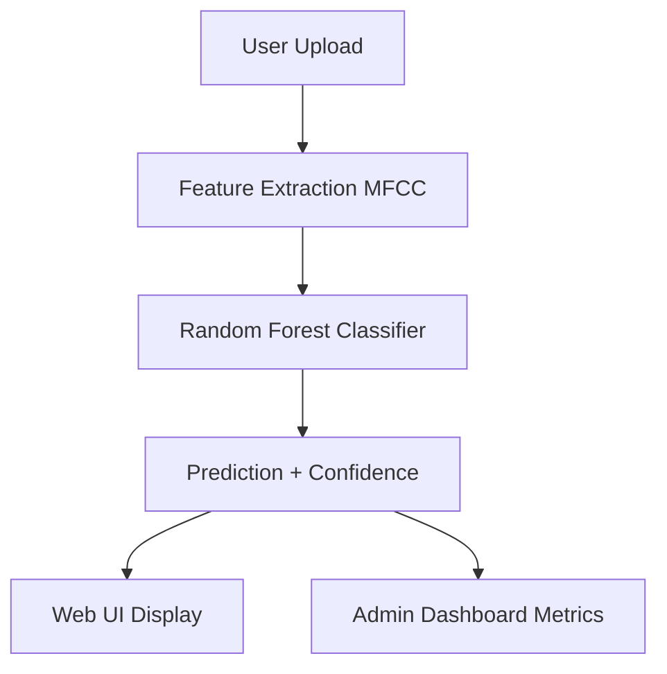

# <p align="center"> 🎙️ Speaker Recognition System [PNA Internship 2025] </p>
### <p align="center"> End-to-End Machine Learning Pipeline with Web Deployment & Admin Analytics </p>

<p align="center">
  
  
  
  
  
</p>

---

## Overview

This project implements a **production-structured Speaker Recognition System** using classical Machine Learning techniques.

It combines:

- **MFCC Feature Extraction**
- **Random Forest Classification**
- **Flask-based REST API**
- **Admin Dashboard with Analytics**
- **Model Persistence & Evaluation Logging**

The system demonstrates a complete **Machine Learning Lifecycle**:

Feature Engineering → Model Training → Evaluation → Deployment → Monitoring


---

# ✨ Features

### Core ML System
- MFCC-based audio feature extraction
- Multi-class speaker identification
- Probability-based confidence scoring
- Model + LabelEncoder persistence
- JSON-based evaluation logging

### Web Application
- Clean responsive UI
- Audio upload & real-time inference
- RESTful prediction endpoint
- Error handling & structured responses

### Admin Dashboard
- Overall model accuracy
- Total speaker count
- Per-speaker precision visualization
- Confusion matrix support
- Stored evaluation metrics

---


# System Architecture

### Option 2: Using Mermaid (Best for GitHub/GitLab)
For graphical look, [GitHub supports Mermaid.js](https://docs.github.com) .



---

### Project Structure
```text
speaker-recognition/
│
├── backend/
│   ├── app.py
│   ├── evaluation.py
│   ├── utils/
│   │   └── feature_extraction.py
│   ├── model/
│   │   ├── speaker_recognition_model.pkl
│   │   └── label_encoder.pkl
│   └── metrics/
│       └── metrics.json
│
├── frontend/
│   ├── templates/
│   │   ├── index.html
│   │   └── dashboard.html
│   └── static/
│       ├── styles.css
│       ├── dashboard.css
│       └── script.js
│
└── README.md
```


---

# 🧠 Machine Learning Pipeline

## Feature Extraction

```python
def extract_features(file_path, n_mfcc=40):
    y, sr = librosa.load(file_path, sr=None)
    mfcc = librosa.feature.mfcc(y=y, sr=sr, n_mfcc=n_mfcc)
    return np.mean(mfcc.T, axis=0).reshape(1, -1)
```
- Mel-Frequency Cepstral Coefficients
- Temporal mean pooling
- Classifier-ready feature vector

## Model Training
```python
clf = RandomForestClassifier(
    n_estimators=300,
    random_state=42,
    n_jobs=-1
)

clf.fit(X_train, y_train_enc)

```
- Multi-class classification
- Probabilistic inference
- Deterministic seed for reproducibility

## Prediction Endpoint
```python
@app.route("/predict", methods=["POST"])
def predict():
    file = request.files["file"]
    features = extract_features(file_path)
    probs = model.predict_proba(features)

    pred_index = np.argmax(probs)
    confidence = float(np.max(probs))

    speaker = encoder.inverse_transform([pred_index])[0]

    return jsonify({
        "speaker": speaker,
        "confidence": confidence
    })
```

---

### 📊 Admin Dashboard
- Accessible at:
```python
http://127.0.0.1:5000/dashboard
```

Displays:
  - Overall Accuracy
  - Total Speakers
  - Per-Speaker Precision Chart
  - Stored Evaluation Metrics

Metrics are generated using:
```python
accuracy_score
classification_report
confusion_matrix
```

### Installation
## 1️⃣ Clone Repository
```python
git clone https://github.com/your-username/speaker-recognition.git
cd speaker-recognition/backend
```

## 2️⃣ Install Dependencies
```python
pip install -r requirements.txt
```
### ▶️ Run Application
```python
python app.py
```
Open:
```python
http://127.0.0.1:5000
```
Dashboard:
```python
http://127.0.0.1:5000/dashboard
```

### Tech Stack
```text
| Layer         | Technology                |
| ------------- | ------------------------- |
| Backend       | Flask                     |
| ML Model      | Scikit-learn              |
| Audio         | Librosa                   |
| Frontend      | HTML5 / CSS3 / JavaScript |
| Visualization | Chart.js                  |
| Persistence   | Joblib                    |
| Data          | NumPy                     |

```
---
### Academic & Professional Value

##This project demonstrates:
  - Classical speaker recognition methodology
  - Feature engineering pipeline
  - Multi-class probabilistic classification
  - ML system deployment architecture
  - Model monitoring dashboard
  - Structured project design
  - 
Ideal for:
  - Final Year Projects
  - Research Demonstrations
  - ML Portfolio Projects
  - Prototype Systems

---
### Future Improvements

  - CNN / LSTM / ECAPA-TDNN integration
  - Real-time microphone streaming
  - Speaker verification (1:1 matching)
  - Model versioning
  - Docker containerization
  - Cloud deployment (AWS / GCP)
  - Role-based admin authentication

---

### 👤 Author

## Soban Hussain, BS Computer Science, Sukkur IBA University
Machine Learning, Deep Learning & AI Systems

---

## 🤝 Let's Connect

I’m always open to discussing Machine Learning, AI Systems, research collaborations, assistive technologies and innovative projects.

📧 **Email:** sobanhussainmahesar@gmail.com  
🔗 **LinkedIn:** https://www.linkedin.com/in/soban-hussaain-java-software-web-developer/

---

### License

This project is intended for academic use and developed during Pakistan National Assembly Secratariat Internship Program 2025.

---
<p align="center"> ⭐ If you find this project useful, consider giving it a star. </p>
